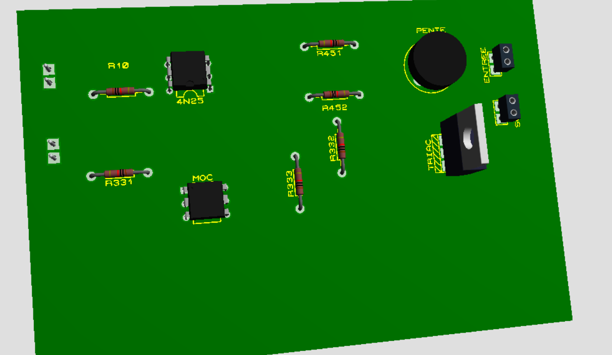
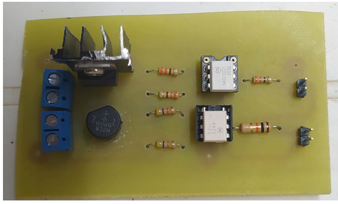
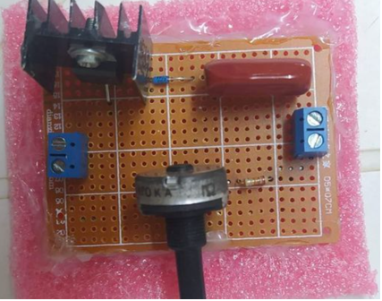

# 🔆 Smart Light Dimmer Project

This repository presents two dimmer circuit solutions for lighting control:

- ✅ **Automatic light dimmer** based on Arduino and Triac control (main solution)
- ✅ **Manual low-cost dimmer** using a potentiometer (alternative solution)

The project includes:
- 🧪 ISIS (Proteus) schematic simulation
- 💻 Arduino source code for automatic control
- 🛠️ PCB design using ARES (with routing and 3D view)
- 📸 Real hardware testing

---

## ⚙️ Solution 1: Automatic Light Dimmer (Arduino-Based)

A smart dimmer circuit that automatically adjusts lighting intensity based on Arduino control. This solution is ideal for energy-efficient lighting systems, smart homes, or automatic lighting environments.

### 📌 Key Features:
- Arduino controls dimming via phase angle control
- Triac-based AC load regulation
- Optocoupler isolation for safety
- Designed in ISIS & ARES (Proteus)
- Real prototype tested

### 📷 Visual Documentation

#### 🔌 ISIS Simulation Schematic  

#### 🧩 PCB Routing in ARES  

#### 🌀 Track Configuration  

#### 🧱 3D View of PCB  

#### 🛠️ Real Board Photo  

#### 📸 Testing Image  

---

## ⚙️ Solution 2: Manual Dimmer with Potentiometer (Low-Cost)

A basic, low-cost dimmer using a potentiometer to control brightness manually. This is a simple hardware-only solution with no microcontroller involved.

### 📌 Key Features:
- Very low cost and easy to build
- No programming required
- Ideal for manual light control applications

#### 🔧 Manual Solution Image  

---

